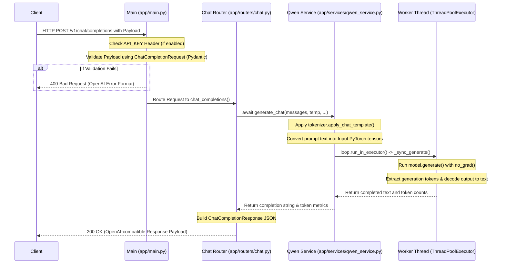

# FastAPI AI Gateway (Qwen 2.5 1.5B)

A FastAPI implementation of the OpenAI chat completions API specification, serving a locally run Qwen 2.5 1.5B Instruct model via HuggingFace Transformers.

## Features

- **OpenAI-Compatible endpoints**: Plugs directly into standard OpenAI clients (SDKs, LangChain, Autogen, LiteLLM) by overriding the `base_url`.
- **Automatic Device Routing**: Auto-detects and loads the model on Apple Silicon (MPS), NVIDIA CUDA GPUs, or standard CPU.
- **Robust Schema Design**: Fully validating JSON request and response payloads built on top of Pydantic v2.
- **Clean Architecture**: Multi-threaded execution isolation for Hugging Face inference logic so it does not block the FastAPI async event loop.

## Setup & Running

### 1. Prerequisites & Installation
Ensure you use a Python virtual environment to install the required packages:
```bash
# Create a virtual environment
python3 -m venv .venv

# Activate the virtual environment
source .venv/bin/activate

# Install dependencies
pip install -r requirements.txt
```

### 2. Configuration (Optional)
Modify the values inside `.env` to switch parameters like `PORT`, `API_KEY` authentication, or specify a custom device.
* **Model Download Behavior**: By default, the application will automatically download the Qwen 2.5 1.5B Instruct model (approx. 3GB) from Hugging Face Hub on the first startup. Subsequent runs will use the cached local copy offline.
* **Custom Local Model Path**: If you already have the model weights downloaded locally, you can change the `MODEL_ID` in `.env` to point to your absolute directory path (e.g. `MODEL_ID=/Users/username/models/Qwen2.5-1.5B-Instruct`) to load it instantly without any downloads.

### 3. Starting the App
Run the server using `uvicorn`:
```bash
# Ensure your virtual environment is active
source .venv/bin/activate

# Start the server
uvicorn app.main:app --host 127.0.0.1 --port 8000
```

### 4. Stopping the App
* **Foreground Process**: If running directly in your terminal, press `CTRL + C` to shut down the server safely.
* **Background Process**: If running as a background task, locate the process ID and terminate it:
```bash
# Find the process running on port 8000
lsof -i :8000

# Kill the process using the PID found
kill <PID>
```

---

## How to Use the Gateway

Once started, the gateway exposes endpoints identical to OpenAI's completion specs. You can request completions via `curl` or using official SDKs.

### Option A: Using `curl`
```bash
curl -X POST http://127.0.0.1:8000/v1/chat/completions \
  -H "Content-Type: application/json" \
  -d '{
    "model": "qwen2.5-1.5b-instruct",
    "messages": [
      {"role": "user", "content": "Explain quantum computing in one sentence."}
    ]
  }'
```

### Option B: Using OpenAI Python SDK
You can easily connect the official `openai` Python library by redirecting the `base_url`:

```python
from openai import OpenAI

# Point client to the local gateway
client = OpenAI(
    base_url="http://127.0.0.1:8000/v1",
    api_key="none"  # Or your custom API_KEY configured in .env
)

response = client.chat.completions.create(
    model="qwen2.5-1.5b-instruct",
    messages=[
        {"role": "user", "content": "Explain quantum computing in one sentence."}
    ]
)

print(response.choices[0].message.content)
```

---

## Example API Queries

### Health Check
```bash
curl http://127.0.0.1:8000/health
```

### Models List
```bash
curl http://127.0.0.1:8000/v1/models
```

### Chat Completions
```bash
curl -X POST http://127.0.0.1:8000/v1/chat/completions \
  -H "Content-Type: application/json" \
  -d '{
    "model": "qwen2.5-1.5b-instruct",
    "messages": [
      {"role": "system", "content": "You are a helpful assistant."},
      {"role": "user", "content": "Tell me a joke about programming."}
    ],
    "temperature": 0.7
  }'
```

---

## Codebase Architecture & Control Flow

To understand how the gateway operates, you can follow this layout of components, entry points, and call sequences:

### Directory Map
```
app/
├── main.py              # Application Bootstrap & Lifespan Hooks (Entry Point)
├── config.py            # Global Settings Configuration Loader
├── models/
│   ├── request.py       # Pydantic v2 validation rules for inputs
│   └── response.py      # OpenAI-compliant schema outputs
├── routers/
│   ├── chat.py          # Chat completions routing ("/v1/chat/completions")
│   ├── completions.py   # Standard completions routing ("/v1/completions")
│   └── health.py        # System diagnostic & availability paths
└── services/
    └── qwen_service.py  # Model weight loader and thread-isolated execution engine
```

### Entry Points

1. **`app.main:app` (Application Entry Point)**:
   This file builds and configures the `FastAPI` instance. It manages:
   * **Lifespan Startup**: Calls `qwen_service.initialize()` to pre-load the model weights, allocate parameters, and warm up the selected hardware device (CPU/MPS/CUDA) so that client requests run fast without startup lag.
   * **Middlewares**: Regulates CORS permissions and enforces static token matches if `API_KEY` is present.
   * **Exception Routing**: Hooks validation errors (`RequestValidationError`) and raw execution errors to return standard OpenAI error format.

2. **`app/services/qwen_service.py` (Core Engine)**:
   A singleton controller which loads the tokenizer and the Hugging Face `Qwen/Qwen2.5-1.5B-Instruct` model weights. To ensure high performance:
   * **Thread Pool Isolation (`ThreadPoolExecutor`)**: Model weight operations are CPU/GPU-bound blocking processes. Running them on FastAPI's main thread would block new incoming HTTP requests. The service executes model runs on a background worker thread (`run_in_executor`), leaving the main async thread free to continue processing and accepting API traffic.

---

### Sequence of Control Flow

When a client hits `POST /v1/chat/completions`:



